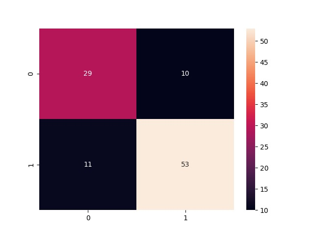
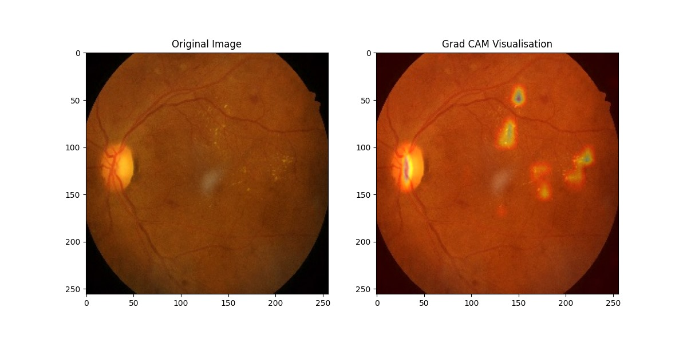

# How to run the code
**Diabetic Retinopthy**  
For Training : ```python main.py --train=True model_name```
model_name can be 'simple_convnet', 'modified_vgg', 'efficientnet_transferlearning'

For Transfer_Learning train_steps to be changed to 2000 in config.gin

For Evaluation: ```python main.py --train=False model_name checkpoint_folder_path```
model_name can be 'simple_convnet', 'modified_vgg', 'efficientnet_transferlearning'
# Results

**Diabetic Retinopathy**

Simple ConvNet is the custom model that is implemented by us using the Swish activation similar to EfficientNet. The same model worked well with LeakyReLU activation as well, better than using ReLU activation. We have also implemented transfer learning through EfficientNetB2. We have implemented metrics such as Accuracy, Confusion Matix and Specificity and Sensitivity.

| **Model**       | **Accuracy(%)** | **Balanced Accuracy(%)**|
|--------------   |-----------------|-------------------------|
| Simple ConvNet  |     77.23       |       75.24             |
| Efficinet Net TF|     85.59       |       84.99             |
| Modified VGG    |     75.72       |       74.95             |

  **Figure 1:** Confusion matrix for Simple Convnet model  
For Visualisation we have implemented GRAD-CAM and also Intergrated Gradients saved in Visualisation folder.
   **Figure 2:** Grad CAM Visulaisation for Simple Convnet model
